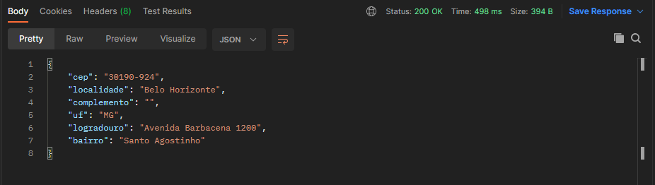

# Desafio banco Inter

## Escopo e objetivo

O projeto foi desenvolvido a partir de um teste pratico proposto pelo banco Inter.
O objetivo dos projeto era a criação de endpoints com Spring Boot framework para o retorno proposto
de um endpoint para retornar o digíto único de um determinado valor, um endpoint para retornar um endereço 
de um determinado Cep e por fim um endpoint para retornar os dois itens o dígito único e o endereço.

NOTA: Consegui fazer a implementação apenas do segundo endpoint do retorno de endereço a partir de um cep.

## Iniciando...

- `git clone https://github.com/costadiogo/zipcode.git`
- `cd zipcode`

## Pré-requisitos

- `Apache Maven 3.8.1`
- `Java JDK 11 LTS`

## Limpar, compilar, executar testes
- `mvn clean`
- `mvn compile`
- `mvn test`
    ou
 - `src > test > java > com > search > zipcode > click com o botão direito em cima da classe ZipCodeControllerTests > Run ZipCodeControllerTests ` 

## Empacotando o projeto
- `mvn package`
-  `java -jar target/zipcode.jar`

## Executando a aplicação e a API
- `mvn spring-boot:run`
    ou
- `src > main > java > com > search > zipcode > click com o botão direito em cima da classe ZipCodeApplication.java > Run ZipCodeAppication...main()` 

## Testando o endpoint 
- `Digite a url abaixo no Postman ou Insomnia`
- `http://localhost:8080/v1/api/30190924`  
 O Objeto Json retornado deverá ser igual ao da imagem abaixo:
  

Você também pode digitar outros cep válidos para testes da api
 
## Documentação e teste
- `Acesse o link abaixo para a documentação no Swagger:`

<a href="http://localhost:8080/swagger-ui/index.html"> Swagger-ui </a>
